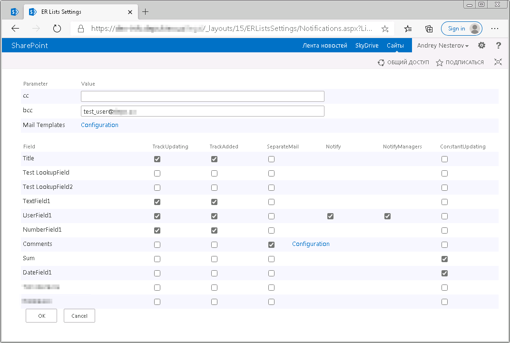

# Description
This project creates a custom SharePoint notifications Event Receiver (ER) that offers more flexible functionalities compared to default notifications.

### Features:
1. SharePoint .wsp solution which activated as feature in per web basis
1. ER parameters are defined in list settings in entry "ER Lists Notifications" (note: not all types of lists has this feature but most of common - defined in project)
1. Main parameters:
  1. Static notified mails: cc, bcc
  1. TrackUpdating - values (current and previous) of checked field includes in notification (only if this field is changed)
  1. TrackAdded - field includes in notification on item creation (only if it containes some value)
  1. Separate Mail - separate notification on item's field change, also has individual mail template settings (eg. useful on adding comments)
  1. Notify - notification for users in checked field
  1. NotifyManagers - notification for all user's managers in checked field
  1. ConstantUpdating - field value always added to notification
1. This solution/project depends on other custom library SPCommonLib which contains some common classes to work with SharePoint objects

### Screenshots
Main settings page:

Mail:

## Disclaimer
**THIS CODE IS PROVIDED _AS IS_ WITHOUT WARRANTY OF ANY KIND, EITHER EXPRESS OR IMPLIED, INCLUDING ANY IMPLIED WARRANTIES OF FITNESS FOR A PARTICULAR PURPOSE, MERCHANTABILITY, OR NON-INFRINGEMENT.**